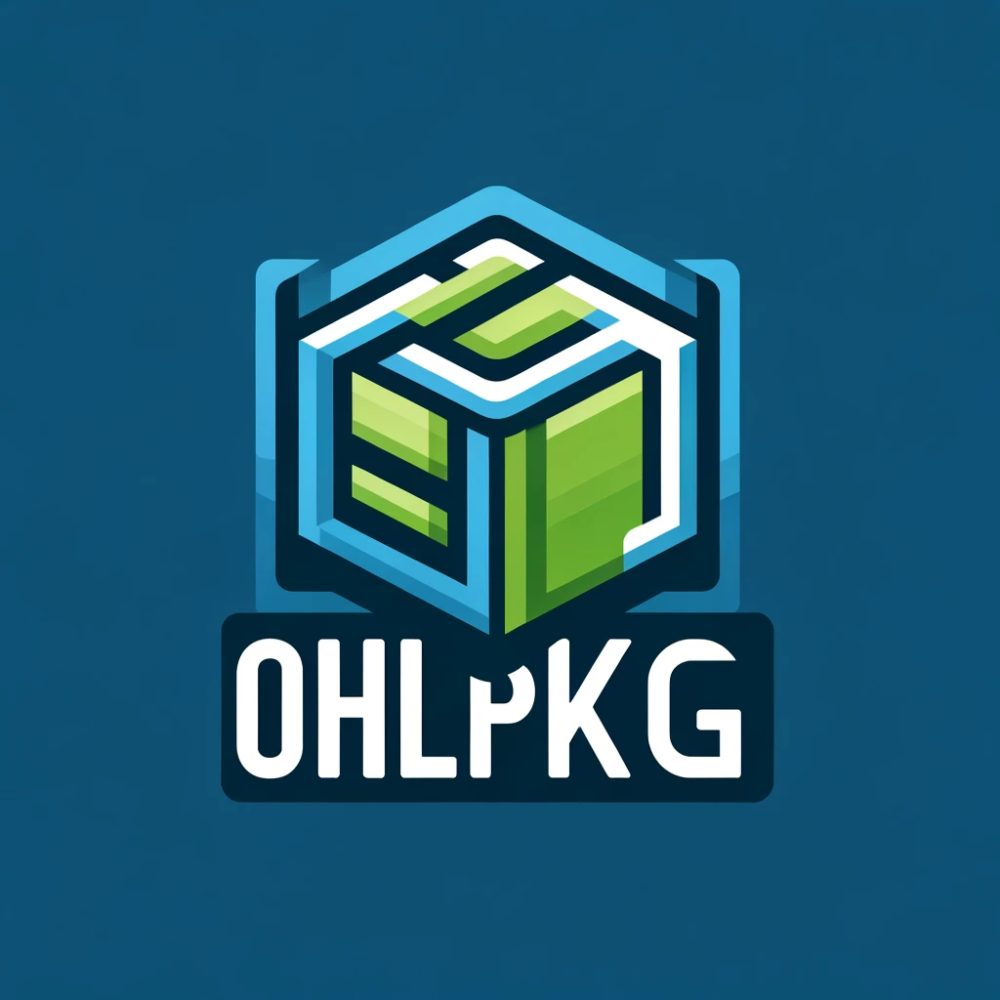

# OHLpkg: R Package for Ontario Hockey League Data

------------------------------------------------------------------------

{width="112"}

------------------------------------------------------------------------

#### **Download this Package**

**`devtools::install_github('NoahCornish/OHLpkg')`**

**`library(OHLpkg)`**

------------------------------------------------------------------------

#### **Latest Version Update**

**Version 1.6.1** has adjusted the file structure for the various functions. No personal code adjustments are necessary.

------------------------------------------------------------------------

#### **Package Functions**

| Function              | Information                                                                |
|------------------|------------------------------------------------------|
| **get_Stats()**       | Returns all skaters statistics                                             |
| **get_GoalieStats()** | Returns goalie statistics (GP\>9)                                          |
| **get_EVStats()**     | Returns skaters (GP\>9) even-strength statistics                           |
| **get_SHStats()**     | Returns skaters (GP\>9) short-handed statistics                            |
| **get_DYStats()**     | Returns skaters (GP\>9) statistics who are NHL draft year (DY-0) eligible  |
| **get_RKStats()**     | Returns skaters (GP\>9) statistics who are playing in their first OHL year |
| **get_Teams()**       | Returns a data table consisting of all 20 OHL teams                        |
| **get_Schedule()**    | Returns a data table consisting of the league schedule and results.        |

------------------------------------------------------------------------

More information about the package can be viewed at (<https://github.com/NoahCornish/OHLpkg/wiki>)

Created by:\
Noah Cornish

