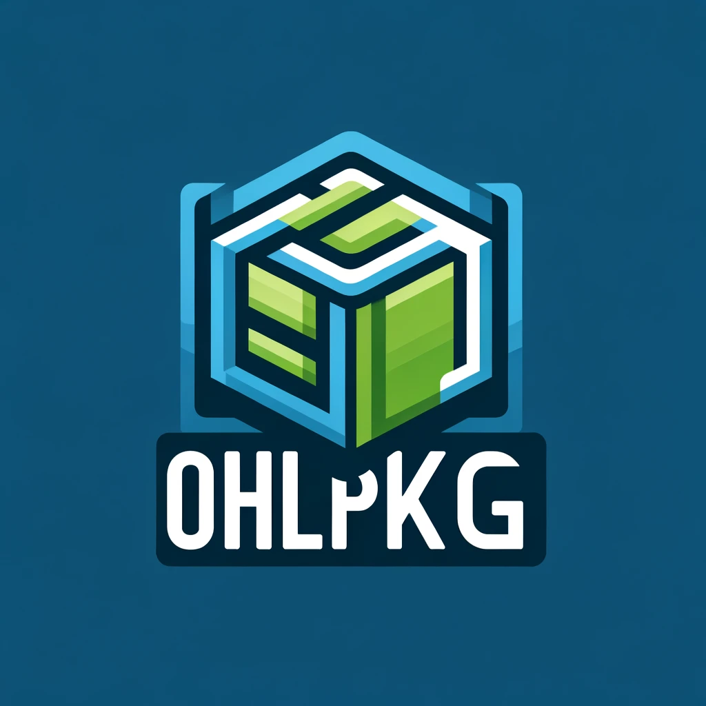

# OHLpkg

### Ontario Hockey League Statistics Tools for R

[](https://github.com/NoahCornish/OHLpkg/releases)
[](https://github.com/NoahCornish/OHLpkg)
[](https://github.com/NoahCornish/OHLpkg/issues)
[](https://github.com/NoahCornish/OHLpkg)
[](LICENSE)

<p align="center">
  
</p>

`OHLpkg` is an R package created by **Noah Cornish** for retrieving clean, ready-to-use Ontario Hockey League data.

The package provides access to skater statistics, goalie statistics, team information, schedules, rookie and draft-eligible players, special-teams production, and individual game events.

---

## What Can OHLpkg Do?

With `OHLpkg`, you can:

- Retrieve current and historical OHL player statistics.
- Include every active skater or apply a minimum-games requirement.
- Filter results by one team or multiple teams.
- Retrieve goalie statistics.
- Calculate even-strength player production.
- Examine short-handed production.
- Identify rookies and NHL draft-eligible players.
- Retrieve player biographical information.
- View the current OHL schedule and game results.
- Retrieve play-by-play events for individual games.
- View all season names supported by the package.

All major functions return standard R data frames that can be used for further analysis, visualization, or export.

> An internet connection is required because `OHLpkg` retrieves information from the OHL's online data feeds.

---

## Installation

`OHLpkg` is currently available through GitHub.

First, install the `remotes` package if it is not already installed:

```r
if (!requireNamespace("remotes", quietly = TRUE)) {
  install.packages("remotes")
}
```

Install `OHLpkg`:

```r
remotes::install_github("NoahCornish/OHLpkg")
```

Load the package:

```r
library(OHLpkg)
```

---

## Start Here

These three commands provide the easiest introduction to the package:

```r
library(OHLpkg)

# View every supported season
get_Seasons()

# Retrieve all active skaters from the current season
players <- get_RawStats("2027 Season")

# View the first six players
head(players)
```

The package uses the ending year when naming a season:

```text
"2027 Season" = 2026–27 OHL regular season
"2026 Season" = 2025–26 OHL regular season
"2026 Playoffs" = 2026 OHL playoffs
"2026 Pre-Season" = 2025–26 OHL preseason
```

Use the season names exactly as displayed by:

```r
get_Seasons()
```

---

## Player Statistics

### Retrieve every active skater

`get_RawStats()` does not apply a games-played cutoff:

```r
raw_stats <- get_RawStats(
  season_name = "2027 Season"
)

head(raw_stats)
```

### Apply a minimum-games requirement

`get_Stats()` includes players with at least 10 games played by default:

```r
player_stats <- get_Stats(
  season_name = "2027 Season"
)
```

Because the current season has only recently started, use `min_games = 0` to include everyone:

```r
player_stats <- get_Stats(
  season_name = "2027 Season",
  min_games = 0
)
```

### Filter by team

```r
london_stats <- get_Stats(
  season_name = "2027 Season",
  min_games = 0,
  team = "London Knights"
)

head(london_stats)
```

Multiple teams can be supplied as a character vector:

```r
team_subset <- get_Stats(
  season_name = "2027 Season",
  min_games = 0,
  team = c("Erie Otters", "Saginaw Spirit")
)
```

Team names must match the names returned by:

```r
get_Teams()
```

---

## Goalie Statistics

Retrieve all goalies from the current season:

```r
goalie_stats <- get_GoalieStats(
  season_name = "2027 Season",
  min_games = 0
)

head(goalie_stats)
```

Apply a team filter:

```r
london_goalies <- get_GoalieStats(
  season_name = "2027 Season",
  team = "London Knights",
  min_games = 0
)
```

The default minimum is 10 games if `min_games` is not specified.

---

## Even-Strength Statistics

`get_EVStats()` calculates:

- Even-strength goals (`EVG`)
- Even-strength assists (`EVA`)
- Even-strength points (`EVPTS`)
- Even-strength points per game (`EVPTS/G`)
- Percentage of total points recorded at even strength (`EVPTS%`)

```r
ev_stats <- get_EVStats(
  season_name = "2027 Season",
  min_games = 0
)

head(ev_stats)
```

---

## Short-Handed Statistics

`get_SHStats()` returns short-handed goals, assists, points, points per game, and percentage of total production:

```r
sh_stats <- get_SHStats(
  season_name = "2027 Season",
  min_games = 0
)

head(sh_stats)
```

---

## Draft-Eligible Players

`get_DYStats()` returns first-time NHL draft-eligible skaters for the selected season:

```r
draft_year_stats <- get_DYStats(
  season_name = "2027 Season",
  min_games = 0
)

head(draft_year_stats)
```

For `"2027 Season"`, the draft-eligible birthdate range is:

```text
September 16, 2008 through September 15, 2009
```

The package calculates the appropriate birthdate range automatically for other supported seasons.

---

## Rookie Statistics

`get_RKStats()` uses the OHL feed's rookie indicator:

```r
rookie_stats <- get_RKStats(
  season_name = "2027 Season",
  min_games = 0
)

head(rookie_stats)
```

Rookies can also be filtered by team:

```r
london_rookies <- get_RKStats(
  season_name = "2027 Season",
  team = "London Knights",
  min_games = 0
)
```

---

## Player Information

Retrieve player IDs and biographical information:

```r
player_info <- get_PlayerInfo(
  season_name = "2027 Season"
)

head(player_info)
```

The returned information includes:

- Player ID
- Player name
- Height
- Weight
- Birthdate
- Team name
- Team ID

---

## Team Information

Retrieve all teams represented in the current season:

```r
teams <- get_Teams()

teams
```

Retrieve teams from another supported season:

```r
previous_teams <- get_Teams(
  season_name = "2026 Season"
)
```

Filter the result:

```r
selected_teams <- get_Teams(
  team = c("London Knights", "Oshawa Generals")
)
```

---

## Current Schedule

Retrieve the current 2026–27 OHL schedule and available results:

```r
schedule <- get_Schedule()

head(schedule)
```

The schedule includes:

- Game date
- Game ID
- Scheduled time
- Home team
- Home score
- Visiting team
- Visiting score

The `ID` column can be supplied to `get_GameEvents()`.

---

## Individual Game Events

First, retrieve the schedule:

```r
schedule <- get_Schedule()
```

Find games with recorded scores:

```r
completed_games <- schedule[
  !is.na(schedule$HomeGoals) &
    !is.na(schedule$VisitorGoals),
]

head(completed_games)
```

Retrieve play-by-play events using a game ID:

```r
game_events <- get_GameEvents(
  game_id = completed_games$ID[1]
)

head(game_events)
```

---

## Function Reference

| Function | Purpose | Main arguments |
|---|---|---|
| `get_Seasons()` | List supported seasons and IDs | None |
| `get_RawStats()` | Retrieve all active skaters | `season_name`, `team` |
| `get_Stats()` | Retrieve skaters using a GP cutoff | `season_name`, `min_games`, `team` |
| `get_GoalieStats()` | Retrieve goalie statistics | `season_name`, `team`, `min_games` |
| `get_EVStats()` | Calculate even-strength production | `season_name`, `team`, `min_games` |
| `get_SHStats()` | Retrieve short-handed production | `season_name`, `team`, `min_games` |
| `get_DYStats()` | Retrieve draft-eligible skaters | `season_name`, `team`, `min_games` |
| `get_RKStats()` | Retrieve rookie skaters | `season_name`, `team`, `min_games` |
| `get_PlayerInfo()` | Retrieve player information | `season_name`, `team` |
| `get_Teams()` | Retrieve unique team names | `team`, `season_name` |
| `get_Schedule()` | Retrieve the current schedule | None |
| `get_GameEvents()` | Retrieve play-by-play events | `game_id` |

Open the package help page:

```r
help(package = "OHLpkg")
```

Open documentation for an individual function:

```r
?get_Stats
?get_GoalieStats
?get_DYStats
```

---

## Common Questions

### Why did `get_Stats()` return no players?

The default minimum is 10 games. Early in a season, players may not have reached that threshold.

Use:

```r
get_Stats(
  season_name = "2027 Season",
  min_games = 0
)
```

### How do I find the correct season name?

Run:

```r
get_Seasons()
```

Season names are case-sensitive and should be entered exactly as displayed.

### How do I find the correct team name?

Run:

```r
get_Teams()
```

### Why did I receive an empty data frame?

The selected season may be recognized by the package before statistics have been published by the OHL feed.

### Why did I receive an API error?

`OHLpkg` depends on an external online data source. Temporary connection problems or changes to the source feed may affect availability.

---

## Version 2.6.0

Version 2.6.0 adds support for the 2026–27 OHL season and significantly improves the package's internal structure.

### Changes

- Added `"2027 Season"` using season ID `88`.
- Added `"2026 Pre-Season"` using season ID `87`.
- Added `"2026 Playoffs"` using season ID `85`.
- Added `get_Seasons()`.
- Centralized season names and IDs.
- Updated current-season defaults to `"2027 Season"`.
- Added clearer season and argument validation.
- Added safer handling for empty and unavailable data.
- Added customizable minimum-games filters.
- Expanded optional team filtering.
- Removed unnecessary package dependencies.
- Removed in-function `library()` calls.
- Improved documentation and package-check compatibility.

---

## Data Availability

Data availability varies by season and statistic.

Some older seasons may not contain every field available in recent seasons. A season may also be recognized before statistics are published.

Use:

```r
get_Seasons()
```

to view the season names currently supported by the package.

---

## Reporting Problems

If you find a problem, unexpected result, or change in the OHL data feed, please open an issue:

[Report an OHLpkg issue](https://github.com/NoahCornish/OHLpkg/issues)

When reporting a problem, include:

- The function you used
- The season name
- Any team or minimum-games filters
- The complete warning or error message
- Your installed version of `OHLpkg`

Check the installed version with:

```r
packageVersion("OHLpkg")
```

---

## Disclaimer

`OHLpkg` is an independent project and is not affiliated with or endorsed by the Ontario Hockey League or Canadian Hockey League.

The package depends on externally maintained data feeds. Data availability, field names, and feed structure may change without notice.

---

## License

`OHLpkg` is available under the MIT License.

---

## Author

Created and maintained by **Noah Cornish**.

- [GitHub](https://github.com/NoahCornish)
- [X/Twitter](https://twitter.com/NoahCornish)
